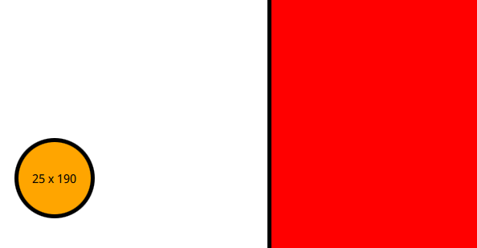
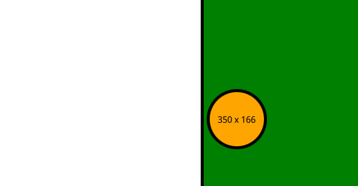

# Qt Drag-n-drop using QML

This project is about doing some drag-n-drop to a rectangle surface and take use of a circle (in QML/Qt, a circle is a rectangle with radius) and this circle is gonna create a Drag signal that is going to be handled by the rectangle on the right by changing its background color.
That means we can use signals through QML without implementing any C++ at all. As QML is a modeling language, we can now not using the QWidget but using only QML in order to create UI for a specific Qt element, and the backend (on server-side) can be handled by other language that is used to make some business logic such as C++, Java, .net and so on.

## Example in-and-out

